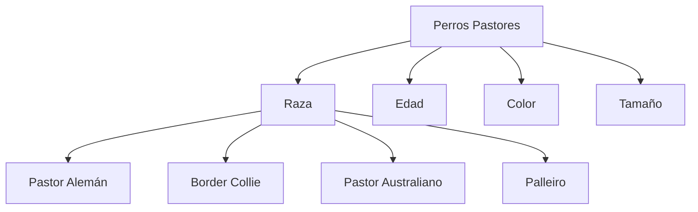

# SINTAXIS BÁSICA
# Encabezado de primer nivel
Lorem ipsum dolor sit amet, consectetur adipiscing elit, sed do eiusmod tempor incididunt ut labore et dolore magna aliqua. Ut enim ad minim veniam, quis nostrud exercitation ullamco laboris nisi ut aliquip ex ea commodo consequat. 

## Encabezado de segundo nivel
Lorem ipsum dolor sit amet, consectetur adipiscing elit, sed do eiusmod tempor incididunt ut labore et dolore magna aliqua. Ut enim ad minim veniam, quis nostrud exercitation ullamco laboris nisi ut aliquip ex ea commodo consequat. 

### Encabezado de terceiro nivel
Lorem ipsum dolor sit amet, consectetur adipiscing elit, sed do eiusmod tempor incididunt ut labore et dolore magna aliqua. Ut enim ad minim veniam, quis nostrud exercitation ullamco laboris nisi ut aliquip ex ea commodo consequat. 

#### Encabezado de cuarto nivel
Lorem ipsum dolor sit amet, consectetur adipiscing elit, sed do eiusmod tempor incididunt ut labore et dolore magna aliqua. Ut enim ad minim veniam, quis nostrud exercitation ullamco laboris nisi ut aliquip ex ea commodo consequat. 

##### Encabezado de quinto nivel
Lorem ipsum dolor sit amet, consectetur adipiscing elit, sed do eiusmod tempor incididunt ut labore et dolore magna aliqua. Ut enim ad minim veniam, quis nostrud exercitation ullamco laboris nisi ut aliquip ex ea commodo consequat. 

###### Encabezado de sexto nivel
Lorem ipsum dolor sit amet, consectetur adipiscing elit, sed do eiusmod tempor incididunt ut labore et dolore magna aliqua. Ut enim ad minim veniam, quis nostrud exercitation ullamco laboris nisi ut aliquip ex ea commodo consequat. 

Este texto NO está en NEGRITA, pero el siguiente sí: **Este texto está en negrita Lorem ipsum dolor sit amet, consectetur adipiscing elit, sed do eiusmod tempor incididunt ut labore et dolore magna aliqua. Ut enim ad minim veniam, quis nostrud exercitation ullamco laboris nisi ut aliquip ex ea commodo consequat.**

Este texto NO está en NEGRITA, pero el siguiente sí: __Este tamén Lorem ipsum dolor sit amet, consectetur adipiscing elit, sed do eiusmod tempor incididunt ut labore et dolore magna aliqua. Ut enim ad minim veniam, quis nostrud exercitation ullamco laboris nisi ut aliquip ex ea commodo consequat.__

Este texto NO está en CURSIVA, pero el siguiente sí: *Este texto Lorem ipsum dolor sit amet, consectetur adipiscing elit, sed do eiusmod tempor incididunt ut labore et dolore magna aliqua. Ut enim ad minim veniam, quis nostrud exercitation ullamco laboris nisi ut aliquip ex ea commodo consequat* está en cursiva*

Este texto NO está en CURSIVA, pero el siguiente sí: _Este tamén Lorem ipsum dolor sit amet, consectetur adipiscing elit, sed do eiusmod tempor incididunt ut labore et dolore magna aliqua. Ut enim ad minim veniam, quis nostrud exercitation ullamco laboris nisi ut aliquip ex ea commodo consequat._

Este texto NO está en TACHADO, pero el siguiente sí: ~~ESTE TEXTO ESTÁ TACHADO, Lorem ipsum dolor sit amet, consectetur adipiscing elit, sed do eiusmod tempor incididunt ut labore et dolore magna aliqua. Ut enim ad minim veniam, quis nostrud exercitation ullamco laboris nisi ut aliquip ex ea commodo consequat. (ALT+126 EN BLOQ NUM)~~

Este texto ES UNA COMBINACIÓN DE LAS ANTERIORES: **Este texto es _cursiva_ y negrita aninada, Lorem ipsum dolor sit amet, consectetur adipiscing elit, sed do eiusmod tempor incididunt ut labore et dolore magna aliqua. Ut enim ad minim veniam, quis nostrud exercitation ullamco laboris nisi ut aliquip ex ea commodo consequat.** 

Este texto ES UNA MEZCLA ENTRE CURSIVA Y NEGRITA: ***Todo en cursiva y negrita, Lorem ipsum dolor sit amet, consectetur adipiscing elit, sed do eiusmod tempor incididunt ut labore et dolore magna aliqua. Ut enim ad minim veniam, quis nostrud exercitation ullamco laboris nisi ut aliquip ex ea commodo consequat.***

El siguiente texto está más abajo es un SUBINDICE: <sub>Esto es un subscript, Lorem ipsum dolor sit amet, consectetur adipiscing elit, sed do eiusmod tempor incididunt ut labore et dolore magna aliqua. Ut enim ad minim veniam, quis nostrud exercitation ullamco laboris nisi ut aliquip ex ea commodo consequat.</sub>Fin

El siguiente texto está más arriba es un SUPERINDICE: <sup>Esto es un superscript, Lorem ipsum dolor sit amet, consectetur adipiscing elit, sed do eiusmod tempor incididunt ut labore et dolore magna aliqua. Ut enim ad minim veniam, quis nostrud exercitation ullamco laboris nisi ut aliquip ex ea commodo consequat.</sup>Fin

El siguiente texto es una cita 
> Esto es una cita, Lorem ipsum dolor sit amet, consectetur adipiscing elit, sed do eiusmod tempor incididunt ut labore et dolore magna aliqua. Ut enim ad minim veniam, quis nostrud exercitation ullamco laboris nisi ut aliquip ex ea commodo consequat. 


A continuación se muestra un texto distintivo: Algunos comandos básicos de git son:

```
git status -s
git add .
git commit -m "Esto es un commit"
git log --oneline
```

A continuación vemos un ejemplo de color que NO funciona: `#RRGGBB`.

A continuación es vemos un ejemplo de enlace: [Kiwoko](https://www.kiwoko.com/).


A continuación tenemos un ejemplode Vínculos Relativos: [Mi primer archivo md](README.md)

A continuación vemos un ejemplo de una imagen 


Especificar temas en los que se muestra una imagen en concreto, así por ejemplo, en caso de funcionar, a continuación se mostraría un umbreon en caso de un tema oscuro y un flareon en caso de un tema claro:

<picture>
  <source srcset="https://static.vecteezy.com/system/resources/previews/000/551/121/non_2x/vector-cartoon-sun.jpg" media="(prefers-color-scheme: dark)">
  
</picture>


**LISTAS**

Ejemplos de Listas sin ordenar:
- Java
+ Pascal
* Kotlin


Ejemplos de Listas sin ordenadas:
1. Contornos
2. Sistemas
3. Programación


Ejemplo de Listas anidadas:
1. Primer elemeto de la lista.
   - Primer elemento anidado.
     - Segundo elemento anidado.


Ejemplo de Listas de tareas
- [x] Primera tarea realizada.
- [ ] Segunda tarea sin realizar.
- [ ] Tercera tarea sin realizar.


**Mencionar personas y equipos:**

Llamar la atención de una persona en github @github/narfesan Qué opinas de esta materia?


**Hacer referencia a recursos externos:**


**Cargar Archivos:**


Puedes cargar activos como imágenes si las arrastras y sueltas, las seleccionas de un buscador de archivos o si las pegas. 


El **uso de emojis** en github ES posible: 

Hola :wave: Mundo :earth_africa:!, solo hay que tener cuidado en como escribir los códigos de los emojis [Codigos_GitHub](https://gist.github.com/rxaviers/7360908)


**Párrafos**:

Ya hemos ido observando que si dejas una línea en blanco entre las líneas de texto se crea un nuevo párrafo.


"Sed ut perspiciatis unde omnis iste natus error sit voluptatem accusantium doloremque laudantium, totam rem aperiam, eaque ipsa quae ab illo inventore veritatis et quasi architecto beatae vitae dicta sunt explicabo. 

Nemo enim ipsam voluptatem quia voluptas sit aspernatur aut odit aut fugit, sed quia consequuntur magni dolores eos qui ratione voluptatem sequi nesciunt. 

Neque porro quisquam est, qui dolorem ipsum quia dolor sit amet, consectetur, adipisci velit, sed quia non numquam eius modi tempora incidunt ut labore et dolore magnam aliquam quaerat voluptatem. Ut enim ad minima veniam, quis nostrum exercitationem ullam corporis suscipit laboriosam, nisi ut aliquid ex ea commodi consequatur? Quis autem vel eum iure reprehenderit qui in ea voluptate velit esse quam nihil molestiae consequatur, vel illum qui dolorem eum fugiat quo voluptas nulla pariatur?"


**Notas al pie**: 

Neque quisquam est, qui dolorem ipsum quia dolor sit amet, consectetur, adipisci velit, sed quia non numquam eius modi tempora incidunt ut labore et dolore magnam aliquam quaerat voluptatem. Ut enim ad minima veniam, quis nostrum exercitationem ullam corporis suscipit laboriosam, nisi ut aliquid ex ea commodi consequatur? Quis autem vel eum iure reprehenderit qui in ea voluptate velit esse quam nihil molestiae consequatur, vel illum qui dolorem eum fugiat quo voluptas nulla pariatur?

Esta es una nota al pie[^1].

Esta es una SEGUNDA línea de una nota al pie[^2].


[^1]: Mi 1º nota.
[^2]: Mi 2º nota al pie diferente a la primera.


**Alertas**:

> [!NOTE]
> Información útil que los usuarios deben conocer, incluso cuando hojean el contenido.

> [!TIP]
> Consejos útiles para hacer las cosas mejor o más fácilmente.

> [!IMPORTANT]
> Información clave que los usuarios necesitan saber para lograr su objetivo.

> [!WARNING]
> Información urgente que necesita atención inmediata del usuario para evitar problemas.

> [!CAUTION]
> Asesora sobre riesgos o resultados negativos de determinadas acciones.


**Ocultar el contenido con comentarios**

En github también podemos ocultar contenido en comentarios como si de un HTML se tratase.
<!--COMENTARIO: At vero eos et accusamus et iusto odio dignissimos ducimus qui blanditiis praesentium voluptatum deleniti atque corrupti quos dolores et quas molestias excepturi sint occaecati cupiditate non provident, similique sunt in culpa qui officia deserunt mollitia animi, id est laborum et dolorum fuga.-->


**Ignorar formato de Markdown**

Se puede pedir a GitHub que ignoreel formato de Markdown escribiendo \ antes del carácter de Markdown.

Vamos a cambiar el nombre \*nuestroProyecto\* a \*nuestroNuevoProyecto\*.


# SINTAXIS AVANZADA


**Creando tablas**

| TH Encabezado  | TH Encabezado |
| -------------  | ------------- |
|    td Celda    |   td Celda    |
|    td Celda    |   td Celda    |
|    td Celda    |   td Celda    |


No es necesario que estea perfectamente alineado:
| Command | Description |
| --- | --- |
| git status -s |  Muestra el estado del directorio de trabajo de forma simplificada |
| git log --oneline| Se imprime una única confirmación en una línea como salida cuando se ejecuta el comando git log |


**Creación de una sección contraída**

Cualquier Markdown dentro del bloque *details* se contraerá hasta que el lector haga clic en para expandir los detalles.

Dentro del bloque *details* <>, usa la etiqueta *summary* <> para que los lectores sepan lo que hay dentro.

<details>
<summary>Ejemplos de sección contraida</summary>

###Encabezado 3

Aquí escribimos lo que queramos. 

Incluido fotos, código, etc.

```Mira un nuevo
    "Hello World"
```
</details>


**Bloques de código:**

Además de texto distintivo también se pueden crear bloques de código:
Puede crear bloques de código delimitados colocando comillas simples triples *(```)* antes y después del bloque de código. 
Se recomienda dejar una línea en blanco antes y después de los bloques de código para facilitar la lectura.

```

<html>
<body>
<h1>Titulo</h1>
<p>Hello World!</p>
</body>
</html>

```

Para mostrar las comillas simples triples en un bloque de código cercado, enciérralas en comillas simples cuádruples:
````
```
Hola Mundo! OTRA VEZ.
```
````


**Crear diagramas de Mermaid**

 ```mermaid
    sequenceDiagram
      Alice->>John: Hola John, ¿cómo estás?
      John-->>Alice: ¡Genial! Gracias por preguntar ¿Y tú?.
      Alice->>John: Muy bien ¡Hasta luego!
      John-->>Alice: Chao.
  ```




**Acerca de la escritura de expresiones matemáticas:**


Esta oración muestra una ecuación $: e^{i\pi} + 1 = 0$


## Este es el final del documento README.


